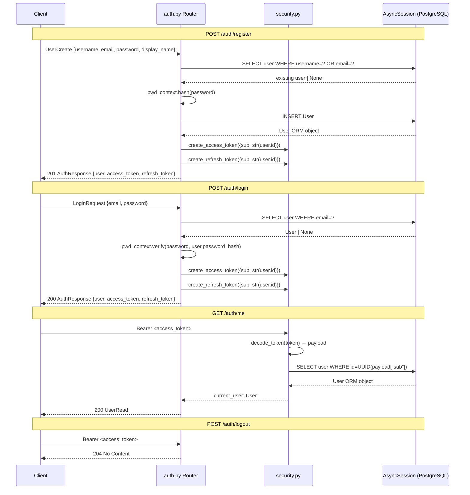

# Design Document: auth-phase1

## Overview

Implement the four authentication endpoints in `app/api/routers/auth.py` — register, login, get-me, and logout — using bcrypt password hashing and HS256 JWTs. Also update `get_current_user` in `security.py` to resolve the JWT `sub` claim into a live `User` ORM object from the database.

## Main Algorithm / Workflow



## Core Interfaces / Types

```python
# app/schemas.py (existing — shown for reference)

class UserCreate(BaseModel):
    username: str = Field(..., min_length=3, max_length=30, pattern=r"^[a-z0-9_]+$")
    email: EmailStr
    password: str = Field(..., min_length=8)
    display_name: str = Field(..., min_length=1, max_length=80)

class UserRead(BaseModel):
    id: uuid.UUID
    username: str
    display_name: str
    avatar_url: Optional[str]
    is_online: bool
    created_at: datetime
    model_config = {"from_attributes": True}

class LoginRequest(BaseModel):
    email: EmailStr
    password: str

class AuthResponse(BaseModel):
    user: UserRead
    access_token: str
    refresh_token: str

# app/models.py (existing — shown for reference)
class User(Base):
    __tablename__ = "users"
    id: Mapped[uuid.UUID]          # primary key, UUID v4
    username: Mapped[str]          # unique, max 30 chars
    email: Mapped[str]             # unique
    password_hash: Mapped[str]
    display_name: Mapped[str]
    avatar_url: Mapped[Optional[str]]
    is_online: Mapped[bool]
    last_seen: Mapped[Optional[datetime]]
    created_at: Mapped[datetime]
```

## Key Functions with Formal Specifications

### `pwd_context` — CryptContext (module-level, `security.py`)

```python
from passlib.context import CryptContext
pwd_context = CryptContext(schemes=["bcrypt"], deprecated="auto")
```

**Postconditions:**
- `pwd_context.hash(plain)` always returns a bcrypt string starting with `$2b$`
- `pwd_context.verify(plain, hashed)` returns `True` iff `plain` matches `hashed`
- `pwd_context.verify` is constant-time (no early exit on mismatch)

---

### `get_current_user` — updated signature (`security.py`)

```python
async def get_current_user(
    credentials: HTTPAuthorizationCredentials = Depends(bearer_scheme),
    db: AsyncSession = Depends(get_db),
) -> User:
```

**Preconditions:**
- `credentials.credentials` is a non-empty string
- `db` is an open `AsyncSession`

**Postconditions:**
- Returns a `User` ORM instance whose `id == UUID(payload["sub"])`
- Raises `HTTP 401` if the token is expired, malformed, or the signature is invalid
- Raises `HTTP 401` if `payload["sub"]` is not a valid UUID string
- Raises `HTTP 401` if no user with that UUID exists in the database

**Loop Invariants:** N/A (no loops)

---

### `register` endpoint (`auth.py`)

```python
@router.post("/register", response_model=AuthResponse, status_code=201)
async def register(body: UserCreate, db: AsyncSession = Depends(get_db)) -> AuthResponse:
```

**Preconditions:**
- `body.username` matches `^[a-z0-9_]+$`, length 3–30
- `body.email` is a valid email address
- `body.password` is at least 8 characters
- `body.display_name` is 1–80 characters

**Postconditions:**
- If a user with `body.username` OR `body.email` already exists → raises `HTTP 409`
- Otherwise: a new `User` row is committed to the database
- Returns `HTTP 201` with `AuthResponse` containing `UserRead` + valid JWT pair
- `access_token` encodes `{"sub": str(new_user.id)}` and expires in `ACCESS_TOKEN_EXPIRE_MINUTES`
- `refresh_token` encodes `{"sub": str(new_user.id)}` and expires in `REFRESH_TOKEN_EXPIRE_DAYS`
- `user.password_hash` is never included in the response

---

### `login` endpoint (`auth.py`)

```python
@router.post("/login", response_model=AuthResponse, status_code=200)
async def login(body: LoginRequest, db: AsyncSession = Depends(get_db)) -> AuthResponse:
```

**Preconditions:**
- `body.email` is a valid email address
- `body.password` is a non-empty string

**Postconditions:**
- If no user with `body.email` exists → raises `HTTP 404`
- If `pwd_context.verify(body.password, user.password_hash)` is `False` → raises `HTTP 401`
- Otherwise: returns `HTTP 200` with `AuthResponse` containing `UserRead` + valid JWT pair
- Tokens carry the same claims structure as in `register`

---

### `get_me` endpoint (`auth.py`)

```python
@router.get("/me", response_model=UserRead)
async def get_me(current_user: User = Depends(get_current_user)) -> UserRead:
```

**Preconditions:**
- Request carries a valid `Authorization: Bearer <token>` header

**Postconditions:**
- Returns `HTTP 200` with `UserRead` serialised from the `User` ORM object resolved by `get_current_user`
- Raises `HTTP 401` if the token is missing, expired, or invalid (delegated to `get_current_user`)

---

### `logout` endpoint (`auth.py`)

```python
@router.post("/logout", status_code=204)
async def logout(current_user: User = Depends(get_current_user)) -> None:
```

**Preconditions:**
- Request carries a valid `Authorization: Bearer <token>` header

**Postconditions:**
- Returns `HTTP 204 No Content` with an empty body
- No database mutations occur
- Access token continues to be valid until its natural expiry (no blacklist in Phase 1)
- Raises `HTTP 401` if the token is missing, expired, or invalid (delegated to `get_current_user`)

## Algorithmic Pseudocode

### Register Algorithm

```python
ALGORITHM register(body: UserCreate, db: AsyncSession) -> AuthResponse

BEGIN
  # 1. Duplicate check
  result = await db.execute(
      select(User).where(or_(User.username == body.username, User.email == body.email))
  )
  existing = result.scalar_one_or_none()

  IF existing IS NOT None THEN
      RAISE HTTPException(status_code=409, detail="Username or email already registered")
  END IF

  # 2. Hash password
  hashed = pwd_context.hash(body.password)

  # 3. Persist new user
  user = User(
      username=body.username,
      email=body.email,
      password_hash=hashed,
      display_name=body.display_name,
  )
  db.add(user)
  await db.commit()
  await db.refresh(user)

  # 4. Issue tokens
  token_data = {"sub": str(user.id)}
  access_token  = create_access_token(token_data)
  refresh_token = create_refresh_token(token_data)

  RETURN AuthResponse(user=UserRead.model_validate(user),
                      access_token=access_token,
                      refresh_token=refresh_token)
END
```

**Preconditions:** `body` passes Pydantic validation; `db` is open  
**Postconditions:** Either `HTTP 409` raised, or a new `User` row exists and `AuthResponse` is returned  
**Loop Invariants:** N/A

---

### Login Algorithm

```python
ALGORITHM login(body: LoginRequest, db: AsyncSession) -> AuthResponse

BEGIN
  # 1. Look up user by email
  result = await db.execute(select(User).where(User.email == body.email))
  user = result.scalar_one_or_none()

  IF user IS None THEN
      RAISE HTTPException(status_code=404, detail="No account found with that email")
  END IF

  # 2. Verify password
  IF NOT pwd_context.verify(body.password, user.password_hash) THEN
      RAISE HTTPException(status_code=401, detail="Incorrect password")
  END IF

  # 3. Issue tokens
  token_data = {"sub": str(user.id)}
  access_token  = create_access_token(token_data)
  refresh_token = create_refresh_token(token_data)

  RETURN AuthResponse(user=UserRead.model_validate(user),
                      access_token=access_token,
                      refresh_token=refresh_token)
END
```

**Preconditions:** `body.email` is valid; `db` is open  
**Postconditions:** Either `HTTP 404`/`401` raised, or `AuthResponse` returned with valid tokens  
**Loop Invariants:** N/A

---

### Updated `get_current_user` Algorithm

```python
ALGORITHM get_current_user(credentials, db: AsyncSession) -> User

BEGIN
  token = credentials.credentials
  payload = decode_token(token)          # raises HTTP 401 on JWTError

  user_id_str = payload.get("sub")
  IF user_id_str IS None THEN
      RAISE HTTPException(status_code=401, detail="Token missing sub claim")
  END IF

  TRY
      user_uuid = uuid.UUID(user_id_str)
  EXCEPT ValueError
      RAISE HTTPException(status_code=401, detail="Invalid sub claim format")
  END TRY

  result = await db.execute(select(User).where(User.id == user_uuid))
  user = result.scalar_one_or_none()

  IF user IS None THEN
      RAISE HTTPException(status_code=401, detail="User not found")
  END IF

  RETURN user
END
```

**Preconditions:** `credentials` is a valid `HTTPAuthorizationCredentials`; `db` is open  
**Postconditions:** Returns `User` ORM object or raises `HTTP 401`  
**Loop Invariants:** N/A

## Example Usage

```python
# --- Register ---
POST /auth/register
{
  "username": "alice",
  "email": "alice@example.com",
  "password": "s3cr3tPass",
  "display_name": "Alice"
}
# → 201
{
  "user": {"id": "...", "username": "alice", "display_name": "Alice", ...},
  "access_token": "<jwt>",
  "refresh_token": "<jwt>"
}

# --- Duplicate registration ---
POST /auth/register  (same username or email)
# → 409 {"detail": "Username or email already registered"}

# --- Login ---
POST /auth/login
{"email": "alice@example.com", "password": "s3cr3tPass"}
# → 200 AuthResponse (same shape as register)

# --- Wrong password ---
POST /auth/login
{"email": "alice@example.com", "password": "wrong"}
# → 401 {"detail": "Incorrect password"}

# --- Get current user ---
GET /auth/me
Authorization: Bearer <access_token>
# → 200 UserRead

# --- Logout ---
POST /auth/logout
Authorization: Bearer <access_token>
# → 204 (no body)
```

## Correctness Properties

- **Password never stored in plaintext**: `∀ user ∈ DB: user.password_hash.startswith("$2b$")`
- **Token sub round-trips**: `∀ user: decode_token(create_access_token({"sub": str(user.id)}))["sub"] == str(user.id)`
- **Uniqueness invariant**: `∀ u1, u2 ∈ DB: u1.id ≠ u2.id ⟹ u1.username ≠ u2.username ∧ u1.email ≠ u2.email`
- **Register idempotency guard**: Calling `POST /auth/register` twice with the same email or username always yields `HTTP 409` on the second call
- **get_me consistency**: `GET /auth/me` with a token issued by `register` or `login` always returns the same user object that was returned in the `AuthResponse`
- **Logout is a no-op**: `POST /auth/logout` never mutates any DB row
- **Token expiry**: Access tokens expire after exactly `ACCESS_TOKEN_EXPIRE_MINUTES` minutes; `decode_token` raises `HTTP 401` after that window

## Error Handling

| Scenario | Status | Detail message |
|---|---|---|
| `register` — username or email taken | 409 | `"Username or email already registered"` |
| `login` — email not found | 404 | `"No account found with that email"` |
| `login` — wrong password | 401 | `"Incorrect password"` |
| Any protected endpoint — missing/expired/invalid token | 401 | `"Could not validate credentials"` |
| Any protected endpoint — user deleted after token issued | 401 | `"User not found"` |
| Any protected endpoint — malformed UUID in sub | 401 | `"Invalid sub claim format"` |

## Files to Modify

| File | Change |
|---|---|
| `app/core/security.py` | Add `pwd_context`; update `get_current_user` to accept `db` and return `User` ORM object |
| `app/api/routers/auth.py` | Implement all four endpoint bodies |

No schema or model changes are required — all types are already defined.
